# Portfolio

---

## 1. Large Language Models (LLMs)

### 1.1 IndoBERT Sentiment Analysis: Sentiment Analysis with IndoBERT Fine-tuning and IndoNLU SmSA Dataset
{:target="_blank"}
{:target="_blank"}

    <strong>Description:</strong>
         
        This project contains the end-to-end development of LLM text classification model by fine-tuning pre-trained IndoBERT model using IndoNLU SmSA dataset. This model is able to predict sentence sentiment into several categories namely positive, neutral, and negative.
         
         
    
<strong>Tech Stack: </strong>Transformers, PyTorch, scikit-learn, Matplotlib, Seaborn, HuggingFaceHub, Pillow, and Streamlit

    
<strong>Streamlit: </strong><a href="https://crypter70-indobert-webapp-sentiment-analysis-using-s-app-l5ogok.streamlit.app/" target="_blank">Sentiment Analysis App</a>

    
<strong>Fine-tuning: </strong><a href="https://github.com/crypter70/Sentiment-Analysis-with-IndoBERT-Fine-tuning-and-IndoNLU-SmSA-Dataset" target="_blank">Fine-tuning GitHub Repository</a>

    
<strong>HuggingFace: </strong><a href="https://huggingface.co/crypter70/IndoBERT-Sentiment-Analysis" target="_blank">IndoBERT-Sentiment-Analysis</a>

     

    <iframe src="https://crypter70-indobert-webapp-sentiment-analysis-using-s-app-l5ogok.streamlit.app?embed=true" style="height: 450px; width: 100%;" frameBorder="0"></iframe>

---

### 1.2 Text Summarization using LangChain and BART Large CNN
{:target="_blank"}
{:target="_blank"}

    <strong>Description:</strong>
         
        This project features the development and implementation of an advanced text summarization system using LangChain and BART-Large-CNN. 
        This project allows users to summarize long text entered in the app into a few sentences.
         
         
    
<strong>Tech Stack: </strong>LangChain, BART Large CNN, HuggingFaceHub, and Streamlit

    
<strong>Streamlit: </strong><a href="https://crypter70-text-summarization-using-langchain-and-bar-app-cqua0w.streamlit.app" target="_blank">Text Summarization App</a>

    
<strong>BART Large CNN: </strong><a href="https://huggingface.co/facebook/bart-large-cnn" target="_blank">Facebook BART Large CNN Model</a>

     

    <iframe src="https://crypter70-text-summarization-using-langchain-and-bar-app-cqua0w.streamlit.app?embed=true" style="height: 450px; width: 100%;" frameBorder="0"></iframe>

---

### 1.3 Document Question Answering using LangChain, F.A.I.S.S., and Gemma
{:target="_blank"}
{:target="_blank"}

    <strong>Description:</strong>
         
        This project features the integration and implementation of an advanced document question answering system using LangChain, FAISS (Facebook AI Similarity Search), and Gemma 7b. This system can answer questions asked by users from documents that have been uploaded.
         
         
    
<strong>Tech Stack: </strong>LangChain, FAISS (Facebook AI Similarity Search), Gemma 7b, Sentence-Transformers, PyPDF2, HuggingFaceHub, and Streamlit

    
<strong>Streamlit: </strong><a href="https://crypter70-document-question-answering-using-langchai-app-xnqae2.streamlit.app" target="_blank">Document Question Answering App</a>

    
<strong>Gemma 7b: </strong><a href="https://huggingface.co/google/gemma-7b" target="_blank">Google Gemma 7B Base Model</a>

     

    <iframe src="https://crypter70-document-question-answering-using-langchai-app-xnqae2.streamlit.app?embed=true" style="height: 450px; width: 100%;" frameBorder="0"></iframe>

---

## 2. Machine Learning

### 2.1 Bank Customer Churn Prediction
{:target="_blank"}
{:target="_blank"}
{:target="_blank"}
{:target="_blank"}

    <strong>Objective:</strong>
         
        This project aims to uncover deep insights about bank customers from data and build a well-performing churn prediction model. The project focuses on transforming data into valuable information and developing a high-performance model for churn prediction of bank customers.
         
         
    <strong>Article:</strong>
     
    
Read the article here (<a href="https://medium.com/@crypter70/bank-customer-churn-prediction-using-machine-learning-514516ecf82e" target="_blank">Medium Article</a>) 

    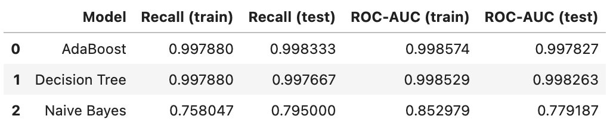
     
     
    

        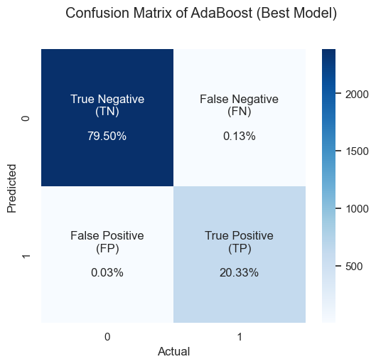
        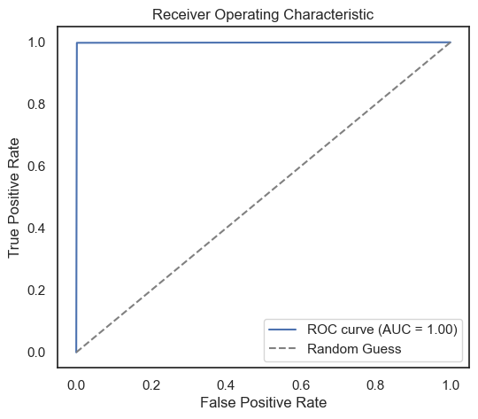
    

        

        <iframe loading="lazy" style="position: absolute; width: 100%; height: 100%; top: 0; left: 0; border: none; padding: 0;margin: 0;"
            src="https:&#x2F;&#x2F;www.canva.com&#x2F;design&#x2F;DAFn-oQ3tJo&#x2F;view?embed" allowfullscreen="allowfullscreen" allow="fullscreen">
        </iframe>
        

        <a href="https:&#x2F;&#x2F;www.canva.com&#x2F;design&#x2F;DAFn-oQ3tJo&#x2F;view?utm_content=DAFn-oQ3tJo&amp;utm_campaign=designshare&amp;utm_medium=embeds&amp;utm_source=link" target="_blank" rel="noopener">Bank Customer Churn Prediction</a> by Yosafat
     
     

---

### 2.2 Electric Vehicle Type Classification
{:target="_blank"}
{:target="_blank"}
{:target="_blank"}
<!--  -->
{:target="_blank"}

    <strong>Objective:</strong>
         
        This project aims to uncover deep electric vehicle insights from data and build a well-performing electric vehicle type classification model. It focuses on turning data into valuable information and developing a high-performance model for electric vehicle type classification.
         
         
    <strong>Article:</strong>
     
    
Read the article here (<a href="https://medium.com/@crypter70/classification-of-electric-vehicle-types-using-machine-learning-7768f6293603" target="_blank">Medium Article</a>) 

    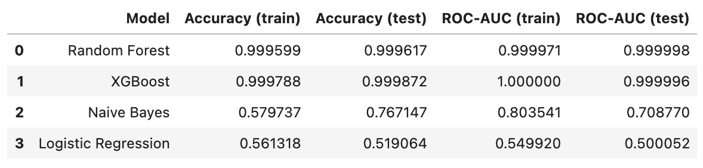
     
     
    

        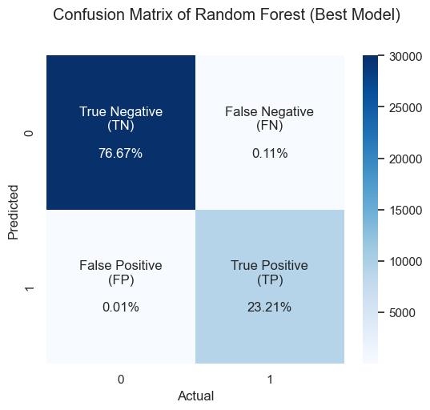
        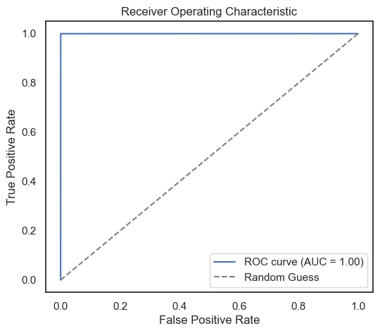
    

    <!--  
    
     
     
    
      -->
     
    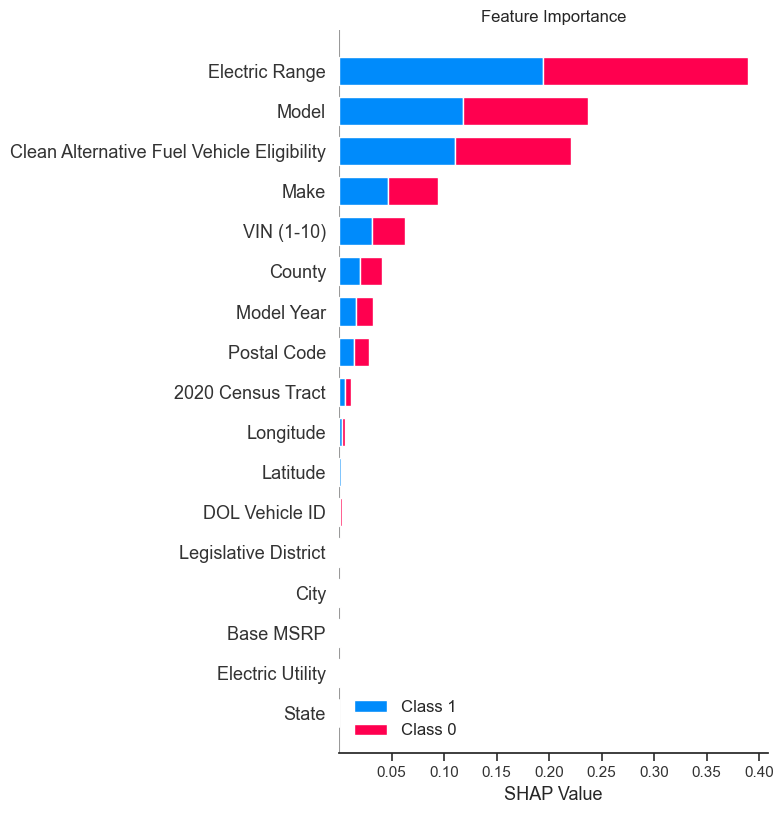
     
     

---

### 2.3 Credit Default Prediction
{:target="_blank"}
{:target="_blank"}
{:target="_blank"}
<!--  -->

    <strong>Objective:</strong>
     
    This project aims to uncover deep credit insights from data and build the best default credit classification model. It focuses on transforming valuable information and developing high performance models for credit classification.

     
    
     
     
    
     
     
    
     
     
    

    <iframe src="https://docs.google.com/presentation/d/e/2PACX-1vSFcLcgoogu3hFxtqEjoJJNCn3tmzibuJhKtXauPxQy6lBXgT0CKxzvB_lojPU92BpankbEQjGzx3dJ/embed?start=false&loop=false&delayms=3000" frameborder="0" style="position: absolute; top: 0; left: 0; width: 100%; height: 100%;" allowfullscreen="true" mozallowfullscreen="true" webkitallowfullscreen="true"></iframe>
    

     
     

---

### 2.4 Stocks Prediction
{:target="_blank"}
{:target="_blank"}
{:target="_blank"}
<!--  -->

    <strong>Objective:</strong>
     
    A Machine Learning project to forecast stock prices using the Long-Short Term Memory (LSTM) algorithm. The forecasted stocks consist of 4 stock codes on the Indonesia Stock Exchange (IDX), 2 stocks each in the banking sector, namely BBCA and BBNI, the mining sector, namely ADRO and INDY.

     
    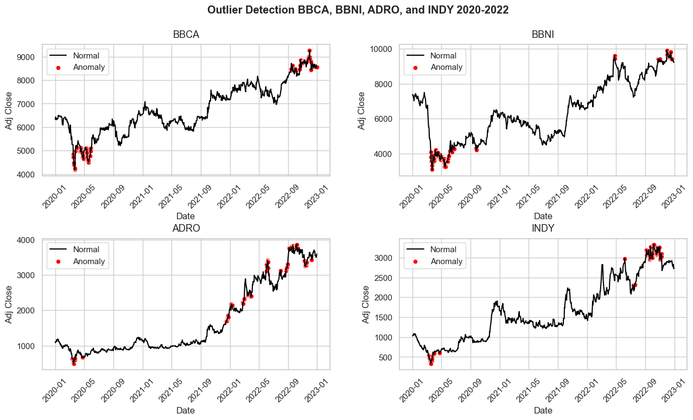
     
    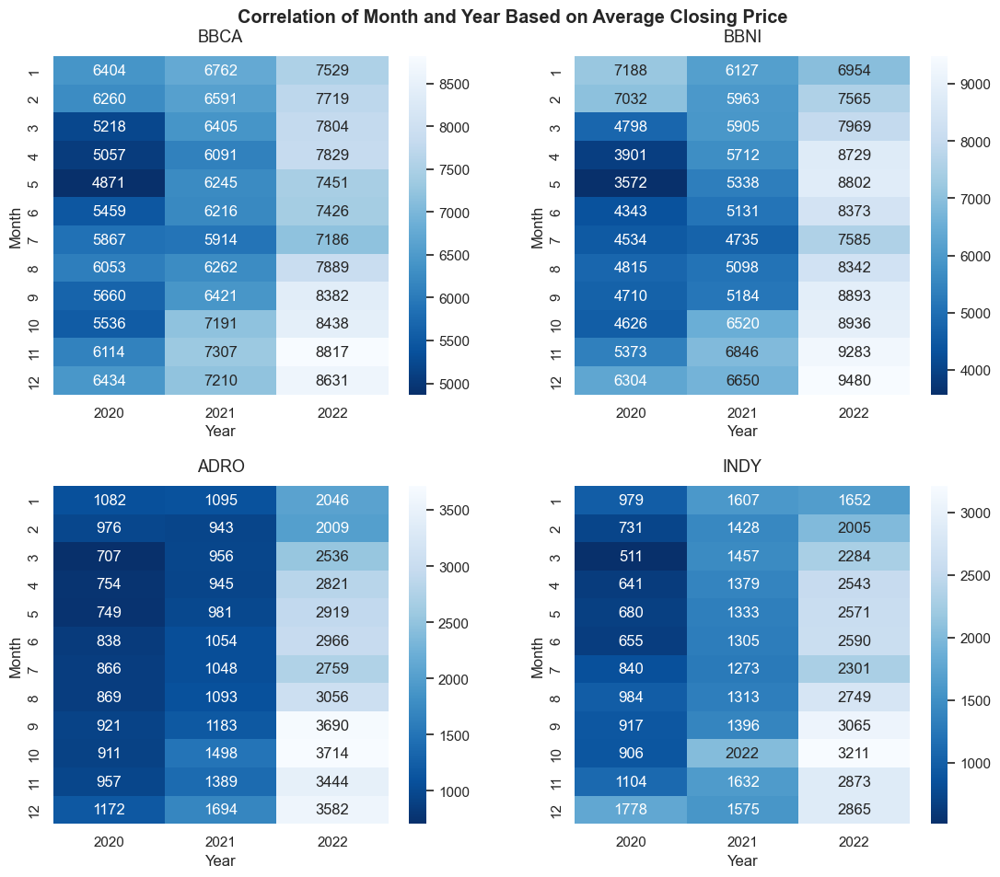
     
    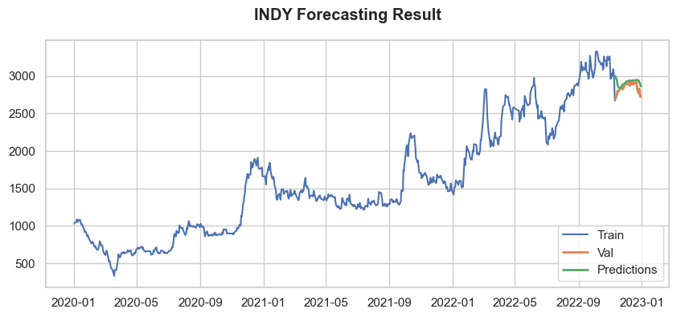
     

---

### 2.5 Topic Extraction
{:target="_blank"}
{:target="_blank"}
{:target="_blank"}
<!--  -->

    <strong>Objective:</strong>
     
    A Machine Learning NLP project to extract research topics based on publication titles using KeyBERT unsupervised keyword extraction approach.

    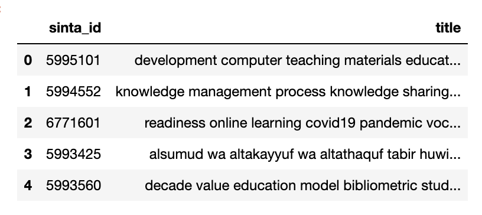
     
    
     

 

---
## 3. Web Scraping 

### 3.1 Tokopedia Scraper
{:target="_blank"}
{:target="_blank"}
{:target="_blank"}

    <strong>Objective:</strong>
     
    The program aimed to extract product data from the Tokopedia marketplace website based on specified keywords using web scraping techniques. Selenium with JavaScript-enabled selectors was utilized to extract the data due to the dynamic elements on the website. The extracted data included product name, price, location, rating, number of items sold, and details link, which were essential for data analysis and market research. The data was saved in both CSV and JSON formats for further processing and analysis.

     
    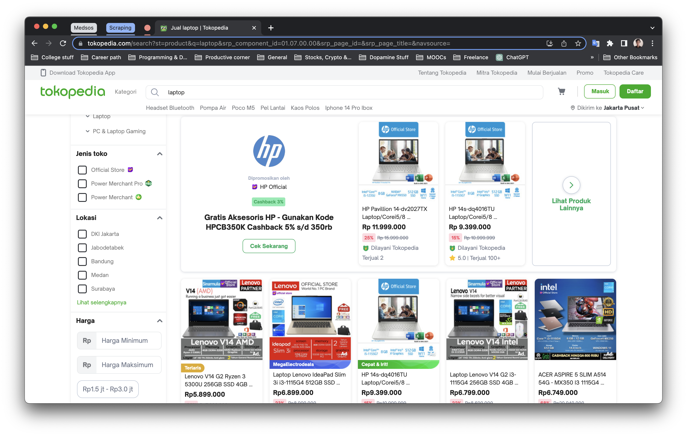
    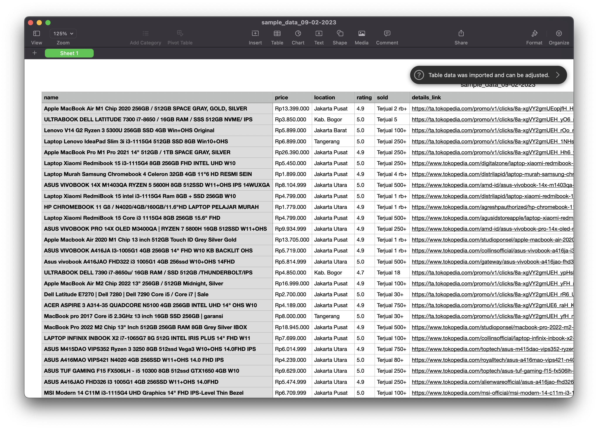
     

---

### 3.2 Nike Scraper
{:target="_blank"}
{:target="_blank"}
<!-- {:target="_blank"} -->

    <strong>Objective:</strong>
     
    Web Scraper program to extract products data from Nike website using Playwright. Playwright is an open-source Node.js library developed by Microsoft for cross-browser web automation and testing. The data retrieved include product name, category, number of colors, and prices which are then exported into csv and json.

     
    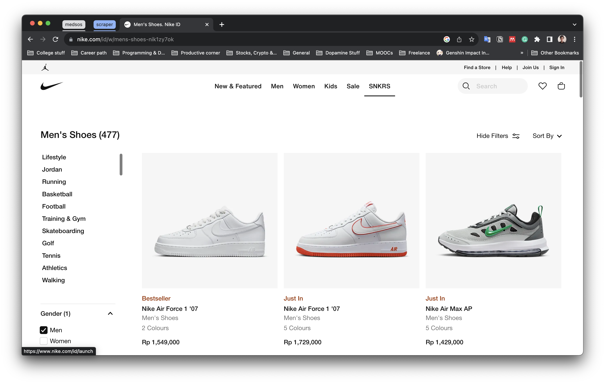
    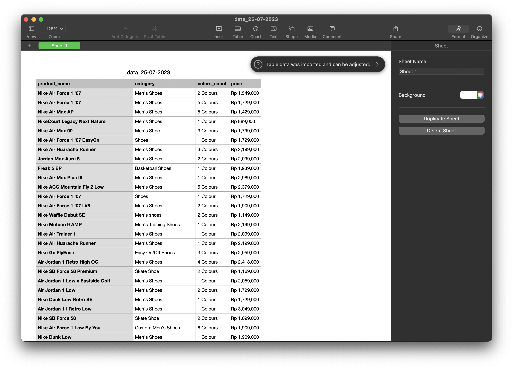
     

---

### 3.3 SINTA Scraper
{:target="_blank"}
{:target="_blank"}

    <strong>Objective:</strong>
     
    The program aimed to extract university data and publication scores from the SINTA website using Scrapy. The targeted website is static, and the data is not loaded using JavaScript, which makes Scrapy an appropriate choice due to its efficiency and speed in handling static data on websites. The extracted data included relevant data such as the university's name, location, and publication scores. The data was saved in CSV format for further processing and analysis.

     
    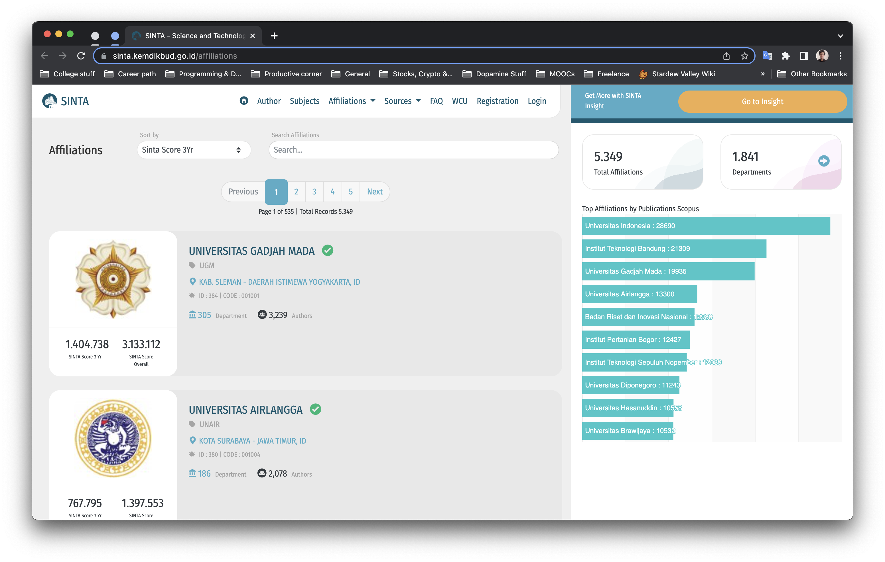
    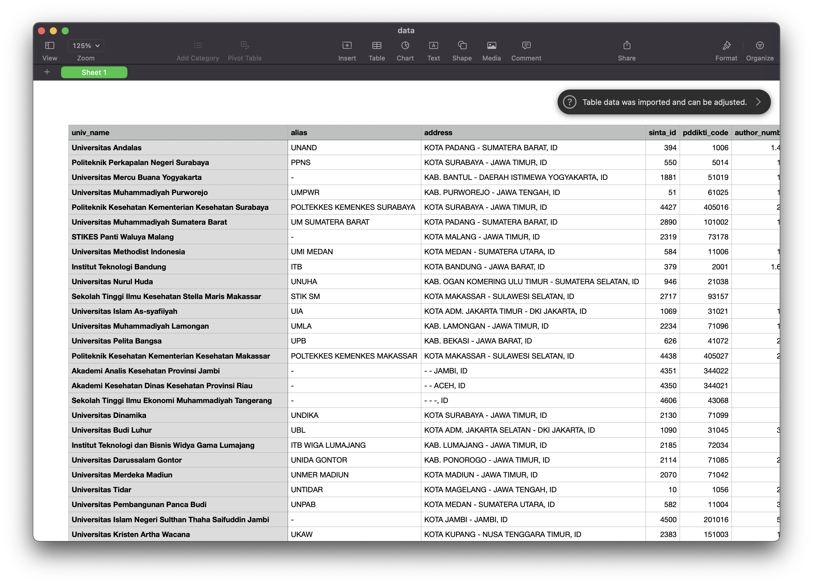
     

---

### 3.4 LTMPT Scraper
{:target="_blank"}
{:target="_blank"}

    <strong>Objective:</strong>
     
    The program aimed to extract data on the top 1000 schools based on UTBK scores in 2022 using Scrapy. The targeted website was a static one, and the data was not loaded using JavaScript. Therefore, Scrapy was an appropriate choice due to its efficiency and speed in handling static data on websites. The program extracted relevant data such as the schools' names, locations, UTBK scores, and other relevant information. The extracted data was useful for analyzing and evaluating the schools' academic performance and ranking. The data was saved in CSV format for further processing and analysis.

     
    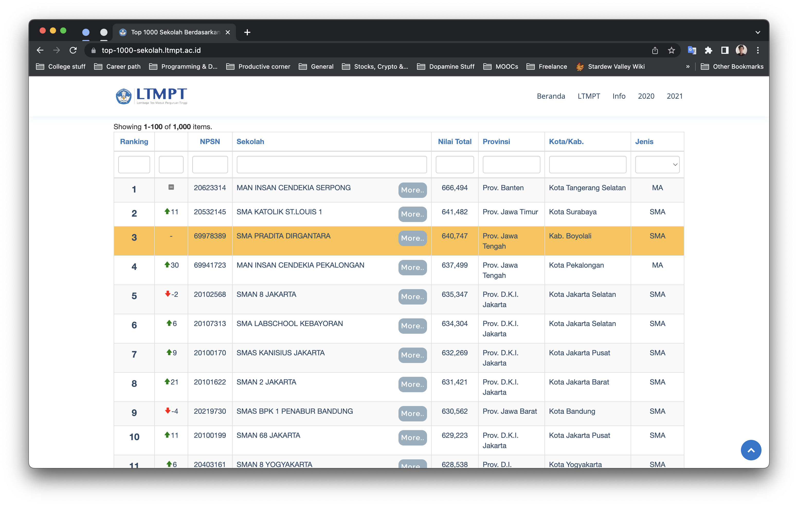
    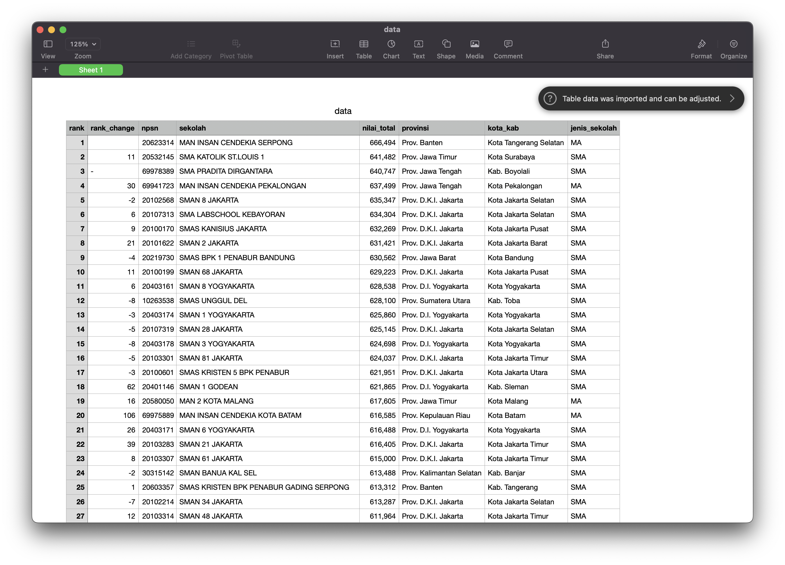
     

---
## Latest Publication
- [Web Scraping Sederhana Menggunakan Scrapy](https://medium.com/@crypter70/web-scraping-sederhana-menggunakan-scrapy-e1e959a05688)
 
- [Bank Customer Churn Prediction using Machine Learning](https://medium.com/@crypter70/bank-customer-churn-prediction-using-machine-learning-514516ecf82e)
 
- [Classification of Electric Vehicle Types using Machine Learning](https://medium.com/@crypter70/classification-of-electric-vehicle-types-using-machine-learning-7768f6293603)
 

---

© 2023 Yosafat. Powered by Jekyll and the Minimal Theme.

