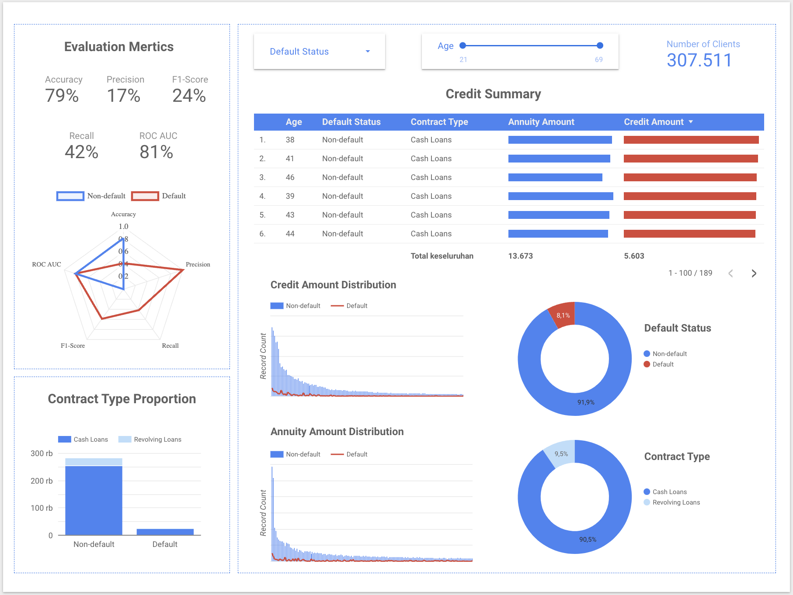
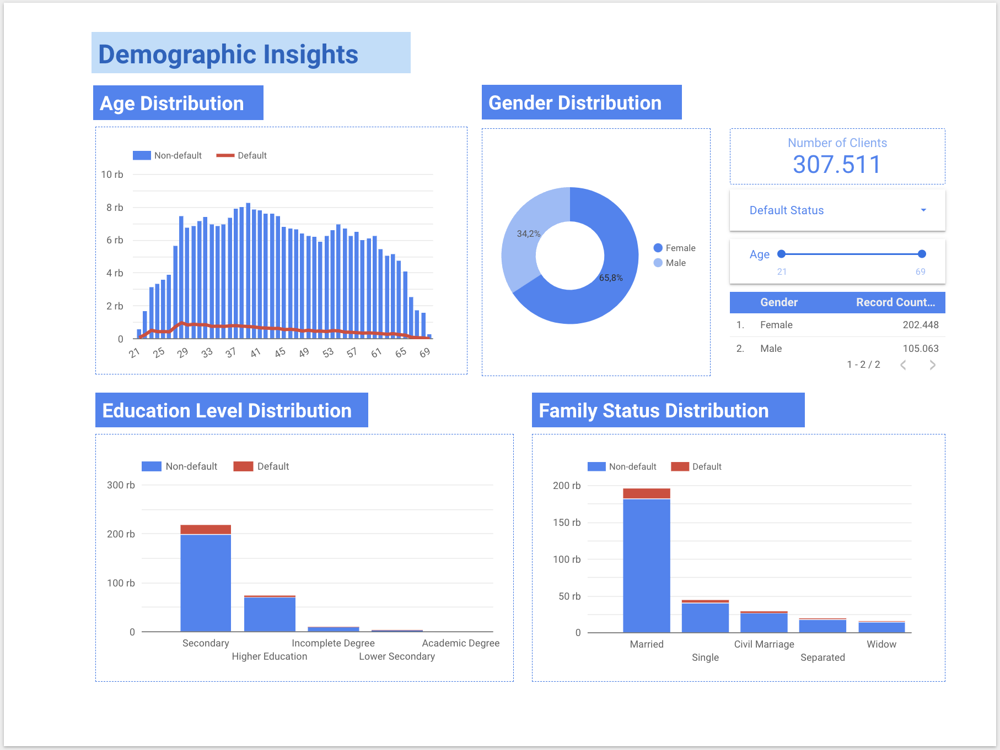
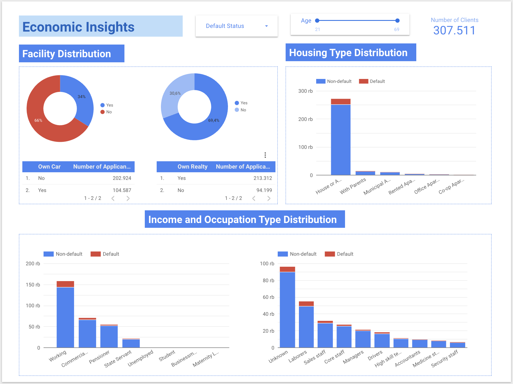
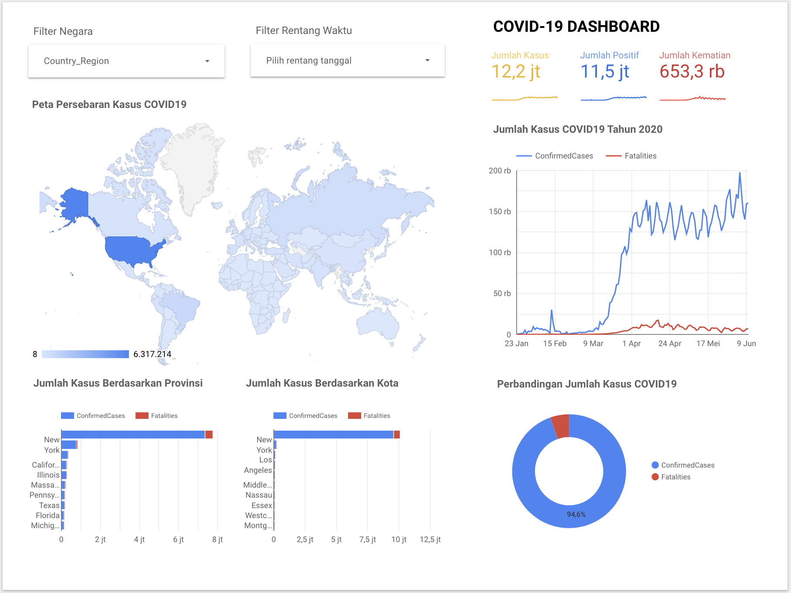

# Portfolio

---

## Data Science

### Bank Customer Churn Prediction
](https://github.com/crypter70/Bank-Customer-Churn-Prediction/blob/main/Bank%20Customer%20Churn%20Prediction.ipynb){:target="_blank"}
{:target="_blank"}
{:target="_blank"}
<!--  -->
<!-- {:target="_blank"} -->

    <strong>Objective:</strong>
         
        This project aims to uncover deep insights about bank customers from data and build a well-performing churn prediction model. The project focuses on transforming data into valuable information and developing a high-performance model for churn prediction of bank customers.
         
         
    <strong>Article:</strong>
     
    
Read the article here (<a href="">Medium Article</a>) 

    
     
    
     
    
     

---

### Electric Vehicle Type Classification
{:target="_blank"}
{:target="_blank"}
{:target="_blank"}
<!--  -->
{:target="_blank"}

    <strong>Objective:</strong>
         
        This project aims to uncover deep electric vehicle insights from data and build a well-performing electric vehicle type classification model. It focuses on turning data into valuable information and developing a high-performance model for electric vehicle type classification.
         
         
    <strong>Article:</strong>
     
    
Read the article here (<a href="https://medium.com/@crypter70/classification-of-electric-vehicle-types-using-machine-learning-7768f6293603">Medium Article</a>) 

    
     
    
     
    
     
    
     

---

### Credit Default Classification
{:target="_blank"}
{:target="_blank"}
{:target="_blank"}
<!--  -->

    <strong>Objective:</strong>
     
    This project aims to uncover deep credit insights from data and build the best default credit classification model. It focuses on transforming valuable information and developing high performance models for credit classification.

     
    
     
    
     
    
     
    

    <iframe src="https://docs.google.com/presentation/d/e/2PACX-1vSFcLcgoogu3hFxtqEjoJJNCn3tmzibuJhKtXauPxQy6lBXgT0CKxzvB_lojPU92BpankbEQjGzx3dJ/embed?start=false&loop=false&delayms=3000" frameborder="0" style="position: absolute; top: 0; left: 0; width: 100%; height: 100%;" allowfullscreen="true" mozallowfullscreen="true" webkitallowfullscreen="true"></iframe>
    

---

### Stocks Prediction
{:target="_blank"}
{:target="_blank"}
{:target="_blank"}
<!--  -->

    <strong>Objective:</strong>
     
    A Machine Learning project to forecast stock prices using the Long-Short Term Memory (LSTM) algorithm. The forecasted stocks consist of 4 stock codes on the Indonesia Stock Exchange (IDX), 2 stocks each in the banking sector, namely BBCA and BBNI, the mining sector, namely ADRO and INDY.

     
    
     
    
     
    
     

---

### Topic Extraction
{:target="_blank"}
{:target="_blank"}
{:target="_blank"}
<!--  -->

    <strong>Objective:</strong>
     
    A Machine Learning NLP project to extract research topics based on publication titles using KeyBERT unsupervised keyword extraction approach.

    
     
    
     

 

---
## Dashboard 
### COVID-19 Cases (Indonesia) Dashboard

    <strong>Objective:</strong>
         
        This project aims to transform raw data into useful information about COVID-19 cases in Indonesia using visualizations on the Tableau dashboard.
         
         
    <strong>Dashboard:</strong>
     
    
Open the dashboard here (<a href="https://public.tableau.com/views/COVID-19CasesIndonesia/Dashboard1?:language=en-US&:display_count=n&:origin=viz_share_link">Tableau Dashboard</a>) 

    
     

---

### Credit Dashboard

    <strong>Objective:</strong>
         
        This project aims to transform raw data into useful information for businesses about credit using visualization on the Looker Studio dashboard.
         
         
    <strong>Dashboard:</strong>
     
    
Open the dashboard here (<a href="https://lookerstudio.google.com/u/0/reporting/6b1a0b77-0425-446e-9a92-9288a87f03c3/page/p_mghv1jr16c">Looker Studio Dashboard</a>) 

    
     
     
    
     
     
    
     

---

### COVID-19 Dashboard

    <strong>Objective:</strong>
         
        This project aims to transform raw data into useful information about COVID-19 cases using visualizations on the Looker Studio dashboard.
         
         
    <strong>Dashboard:</strong>
     
    
Open the dashboard here (<a href="https://lookerstudio.google.com/u/0/reporting/f6b45eb1-9d07-4d7d-b432-d106743437ff/page/p_42tl4mcf6c">Looker Studio Dashboard</a>) 

    
     

---
## Web Scraping 
### Tokopedia Scraper

{:target="_blank"}
{:target="_blank"}
{:target="_blank"}

    <strong>Objective:</strong>
     
    The program aimed to extract product data from the Tokopedia marketplace website based on specified keywords using web scraping techniques. Selenium with JavaScript-enabled selectors was utilized to extract the data due to the dynamic elements on the website. The extracted data included product name, price, location, rating, number of items sold, and details link, which were essential for data analysis and market research. The data was saved in both CSV and JSON formats for further processing and analysis.

     
    
    
     

---

### SINTA Scraper
{:target="_blank"}
{:target="_blank"}

    <strong>Objective:</strong>
     
    The program aimed to extract university data and publication scores from the SINTA website using Scrapy. The targeted website is static, and the data is not loaded using JavaScript, which makes Scrapy an appropriate choice due to its efficiency and speed in handling static data on websites. The extracted data included relevant data such as the university's name, location, and publication scores. The data was saved in CSV format for further processing and analysis.

     
    
    
     

---

### LTMPT Scraper
{:target="_blank"}
{:target="_blank"}

    <strong>Objective:</strong>
     
    The program aimed to extract data on the top 1000 schools based on UTBK scores in 2022 using Scrapy. The targeted website was a static one, and the data was not loaded using JavaScript. Therefore, Scrapy was an appropriate choice due to its efficiency and speed in handling static data on websites. The program extracted relevant data such as the schools' names, locations, UTBK scores, and other relevant information. The extracted data was useful for analyzing and evaluating the schools' academic performance and ranking. The data was saved in CSV format for further processing and analysis.

     
    
    
     

---

© 2023 Yosafat. Powered by Jekyll and the Minimal Theme.

